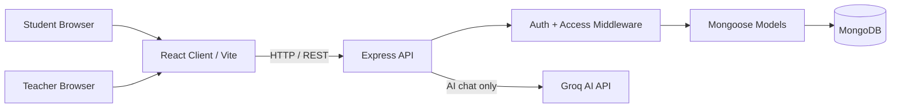
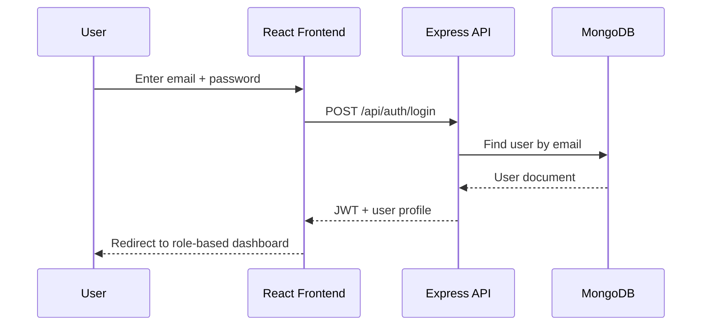
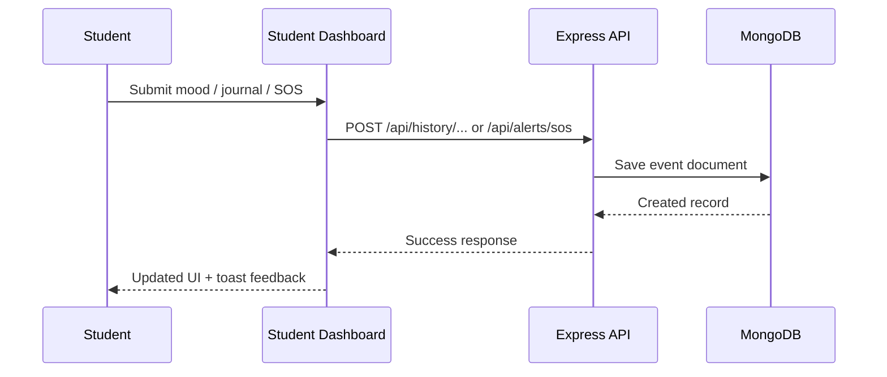
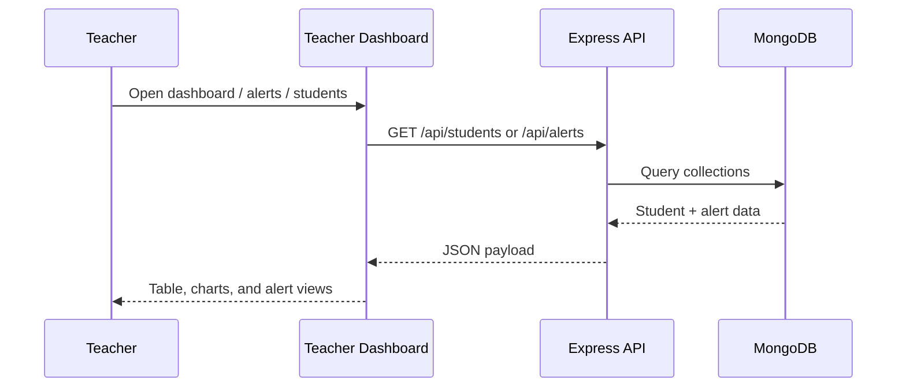

# Phase 1: Tech Stack and Architecture

This document packages the Phase 1 architecture deliverables for the Student
Behavioral Wellness Tracker.

## 1. Selected Stack

### Chosen stack: MERN

- MongoDB: flexible document storage for wellness history, alerts, and messages
- Express.js: lightweight REST API layer for auth, CRUD, and role-based access
- React + Vite: fast frontend iteration with component-based dashboards
- Node.js: backend runtime for API, auth, integrations, and deployment scripts

## 2. Why MERN Fits This Project

### Product fit

- The platform stores user-centered, evolving wellness records.
- Student activity is naturally document-oriented: check-ins, journals, alerts,
  and messages are event-style records.
- Both dashboards benefit from rapid UI iteration and reusable components.

### Technical fit

- MongoDB + Mongoose makes it easy to model both structured user profiles and
  timeline-style wellness entries.
- Express keeps the backend small and readable for viva explanation.
- React supports role-based student and teacher dashboards from a shared codebase.
- Node allows the same language across frontend and backend, reducing team
  onboarding cost.

## 3. High-Level Architecture



## 4. System Flow

### Login flow



### Student wellness flow



### Teacher monitoring flow



## 5. Backend Component Responsibilities

- `backend/server.js`
  Creates the Express app, CORS policy, security headers, JSON parsing,
  database connection, and route registration.
- `backend/routes/auth.js`
  Handles student registration and user login with JWT issuance.
- `backend/routes/students.js`
  Handles teacher-side student management and student profile updates.
- `backend/routes/history.js`
  Handles student mood check-ins, journal entries, history listing, and delete.
- `backend/routes/alerts.js`
  Handles SOS alert creation and teacher-side alert operations.
- `backend/routes/messages.js`
  Handles teacher-student messaging.
- `backend/models/*`
  Defines MongoDB collections and indexes through Mongoose schemas.

## 6. Frontend Component Responsibilities

- `client/src/context/AuthContext.jsx`
  Stores authenticated user state and auth actions.
- `client/src/pages/Login.jsx`
  Handles login and student registration UI.
- `client/src/pages/StudentDashboard.jsx`
  Handles mood logging, journaling, SOS, history, and AI/teacher chat tabs.
- `client/src/pages/TeacherDashboard.jsx`
  Handles analytics, student monitoring, alerts, and management views.
- `client/src/components/*`
  Encapsulates reusable UI for alerts, chat, settings, student directory, and
  detail panels.

## 7. Deployment-Oriented Architecture Notes

- Frontend and backend are separated into `client/` and `backend/`.
- Environment variables are already split into:
  - `backend/.env.example`
  - `client/.env.example`
- CI verification exists in `.github/workflows/ci.yml`.
- Staging rollout docs already exist in `docs/STAGING_DEPLOY.md`.

## 8. Folder Structure

```text
Student Behavioral Wellness Tracker/
|-- backend/
|   |-- middleware/
|   |-- models/
|   |-- routes/
|   |-- test/
|   |-- server.js
|-- client/
|   |-- public/
|   |-- src/
|   |   |-- components/
|   |   |-- context/
|   |   |-- pages/
|   |   |-- lib/
|   |-- vite.config.js
|-- docs/
|-- .github/workflows/
|-- README.md
```

## 9. Architecture Summary for Viva

- MERN was selected because the project needs a responsive dashboard frontend,
  lightweight API layer, JWT authentication, and flexible event-oriented data.
- The system is organized as a clean client-server architecture.
- MongoDB stores the operational wellness data while Express exposes REST APIs.
- The AI assistant is isolated as an external integration rather than being mixed
  into the core database flow.
