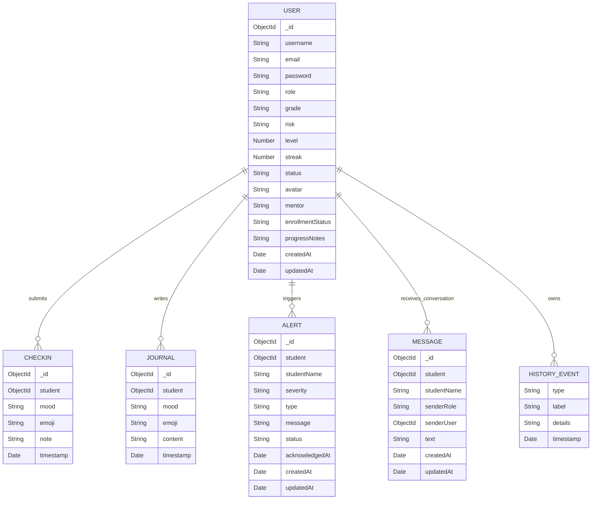

# Phase 1: Database Schema and ERD

This document packages the database design deliverables for Phase 1.

## 1. Database Choice

### Database: MongoDB with Mongoose

Why it fits:

- wellness events are naturally document-driven
- flexible schema supports iterative product growth
- nested history events fit well inside the user profile
- indexes can still optimize high-read paths such as alerts, messages, and
  student history timelines

## 2. Core Entities

- `User`
- `CheckIn`
- `Journal`
- `Alert`
- `Message`
- `historyEvent` embedded in `User`

## 3. ER Diagram

## 4. Collection Structure and Field Types

### `users`

| Field | Type | Notes |
|---|---|---|
| `_id` | ObjectId | primary key |
| `username` | String | required, unique, trimmed |
| `email` | String | required, unique, lowercase |
| `password` | String | required, hashed before save |
| `role` | String | enum: `student`, `teacher`, `counselor` |
| `grade` | String | optional student metadata |
| `risk` | String | enum: `Low`, `Medium`, `High`, `Stable` |
| `level` | Number | gamification level |
| `streak` | Number | check-in streak |
| `status` | String | latest emotional state label |
| `avatar` | String | emoji/avatar text |
| `mentor` | String | staff assignment |
| `enrollmentStatus` | String | enum: `Active`, `Inactive` |
| `progressNotes` | String | teacher notes |
| `history` | Array<historyEvent> | embedded activity history |
| `createdAt` | Date | auto timestamp |
| `updatedAt` | Date | auto timestamp |

Indexes:

- `{ role: 1, createdAt: -1 }`

### `checkins`

| Field | Type | Notes |
|---|---|---|
| `_id` | ObjectId | primary key |
| `student` | ObjectId | ref to `User` |
| `mood` | String | required mood enum |
| `emoji` | String | required |
| `note` | String | optional |
| `timestamp` | Date | defaults to now |

Indexes:

- `{ student: 1, timestamp: -1 }`

### `journals`

| Field | Type | Notes |
|---|---|---|
| `_id` | ObjectId | primary key |
| `student` | ObjectId | ref to `User` |
| `mood` | String | required mood enum |
| `emoji` | String | optional |
| `content` | String | required journal text |
| `timestamp` | Date | defaults to now |

Indexes:

- `{ student: 1, timestamp: -1 }`

### `alerts`

| Field | Type | Notes |
|---|---|---|
| `_id` | ObjectId | primary key |
| `student` | ObjectId | ref to `User` |
| `studentName` | String | denormalized for teacher display |
| `severity` | String | enum: `High`, `Medium`, `Low` |
| `type` | String | alert category |
| `message` | String | alert body |
| `status` | String | enum: `Unread`, `Read` |
| `acknowledgedAt` | Date | nullable |
| `createdAt` | Date | auto timestamp |
| `updatedAt` | Date | auto timestamp |

Indexes:

- `{ status: 1, severity: 1, createdAt: -1 }`

### `messages`

| Field | Type | Notes |
|---|---|---|
| `_id` | ObjectId | primary key |
| `student` | ObjectId | conversation owner |
| `studentName` | String | denormalized for lookup/display |
| `senderRole` | String | enum: `student`, `teacher`, `counselor` |
| `senderUser` | ObjectId | ref to `User` |
| `text` | String | message body, max 2000 |
| `createdAt` | Date | auto timestamp |
| `updatedAt` | Date | auto timestamp |

Indexes:

- `{ student: 1, createdAt: 1 }`

## 5. Relationship Notes

- One student can create many check-ins.
- One student can create many journal entries.
- One student can trigger many alerts.
- One student can have many messages in a single conversation timeline.
- Teacher-driven administrative history is embedded inside the `User` document
  because it is read together with student detail views.

## 6. Data Modeling Rationale

- `studentName` is duplicated in alerts/messages to simplify teacher UI reads
  without repeated joins/populates.
- `history` is embedded in `User` because it behaves like profile-level metadata.
- high-volume timeline data such as journals and check-ins stay in dedicated
  collections so they can grow independently.

## 7. Future Schema Extensions

- add `attachments` for counselor notes
- add `attendance` or `wellness score` snapshots
- add `notification preferences` collection
- add `audit logs` for administrative actions
