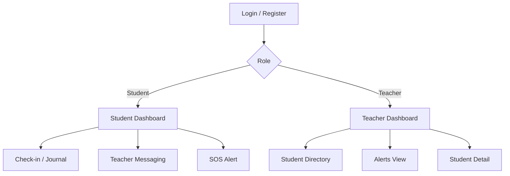

# Phase 1: UI/UX Wireframes and Theme

This document packages the Phase 1 UI/UX deliverables using text wireframes and
theme notes so the project can be reviewed directly from the repository.

## 1. Design Direction

### Product mood

- safe
- calm
- supportive
- school-friendly
- modern but not clinical

### Color palette

| Role | Color | Hex |
|---|---|---|
| Primary | Indigo | `#4F46E5` |
| Primary dark | Deep indigo | `#4338CA` |
| Secondary | Teal | `#14B8A6` |
| Surface | White | `#FFFFFF` |
| Background | Slate 50 | `#F8FAFC` |
| Success | Green | `#22C55E` |
| Warning | Amber | `#F59E0B` |
| Danger | Red | `#DC2626` |
| Text | Slate 800 | `#1E293B` |
| Muted text | Slate 500 | `#64748B` |

### UX goals

- students should feel low friction and emotionally safe
- teachers should see urgency and risk quickly
- important actions should have immediate feedback via loaders and toasts
- layouts must stay readable on mobile and desktop

## 2. User Journey



## 3. Wireframe: Login Page

```text
+--------------------------------------------------------------+
|                         CLASSMIND                            |
|              Student Behavioral Wellness Tracker             |
|--------------------------------------------------------------|
|                     Welcome Back / Sign Up                   |
|         [ Full Name ]  (register only for students)          |
|         [ Email Address ]                                    |
|         [ Password ]                                         |
|                                                              |
|                [ Sign In / Create Account ]                  |
|                                                              |
|                Google            GitHub                      |
|                                                              |
|          Toggle between Sign In and Student Sign Up          |
+--------------------------------------------------------------+
```

## 4. Wireframe: Student Dashboard

```text
+--------------------------------------------------------------------------------+
| Hi, Student!                                  [Calm Down] [SOS] [Logout]      |
|--------------------------------------------------------------------------------|
| Quote of the Day                                                               |
|--------------------------------------------------------------------------------|
| How are you feeling today?                                                     |
| [Happy] [Calm] [Stressed] [Tired]                                              |
|--------------------------------------------------------------------------------|
| History Timeline              | Journal                                        |
| - date grouped entries        | [ text area ]                                  |
| - mood badges                 |                    [ Save Entry ]              |
| - delete action               |                                                |
|--------------------------------------------------------------------------------|
| WellnessBuddy / Teacher Chat  | Achievements / XP / Streak                     |
| chat panel                    | gamification card                              |
+--------------------------------------------------------------------------------+
```

## 5. Wireframe: Teacher Dashboard

```text
+----------------------+---------------------------------------------------------+
| Sidebar              | Header: greeting, alerts bell, profile                 |
| - Dashboard          |---------------------------------------------------------|
| - Students           | Emergency Banner (only when active SOS exists)          |
| - Alerts             |---------------------------------------------------------|
| - Settings           | Mood Chart   Risk Chart   Engagement Trend              |
|                      |---------------------------------------------------------|
|                      | Student Directory Table                                 |
|                      | Search: [.................]                             |
|                      |                                                         |
|                      | Name | Level | Status | Streak | Risk | Action         |
|                      |                                                         |
+----------------------+---------------------------------------------------------+
```

## 6. Wireframe: Alerts View

```text
+--------------------------------------------------------------------------------+
| Risk Alerts & Notifications                             [All] [Unread] [High] |
|--------------------------------------------------------------------------------|
| Alert Card                                                                      |
| Student Name         Severity Badge         Type         Time                   |
| Message text                                                                  X |
| [Mark as Read] [Chat with Student]                                            |
|--------------------------------------------------------------------------------|
| Empty state: "No alerts found"                                                 |
+--------------------------------------------------------------------------------+
```

## 7. Wireframe: Student Directory / Detail Flow

```text
Teacher Dashboard
    -> Student Directory Table
        -> select student
            -> Student Detail Modal
                - profile header
                - mood trend chart
                - wellness radar
                - activity timeline
                - mentor / risk / visit actions
```

## 8. Responsive Notes

### Desktop

- teacher experience uses sidebar + content area
- student dashboard uses multi-column cards

### Mobile

- cards stack vertically
- actions move into wrapped button rows
- charts and tables should remain scrollable without breaking layout

## 9. Theme Summary for Evaluation

- student UI emphasizes encouragement, softness, and reflection
- teacher UI emphasizes visibility, triage, and actionability
- indigo + teal are the primary wellness brand colors
- red and amber are reserved for alerts and risk communication
